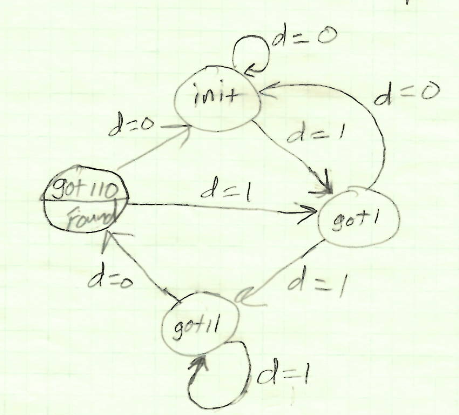
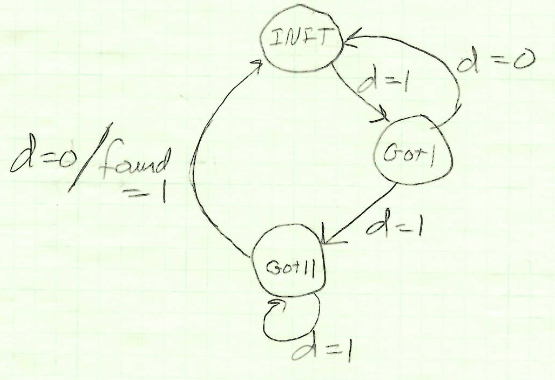

[[back to Contents]](https://github.com/Amulek1416/verilog-help-sheet/blob/main/README.md)
# State Machines

State machines are a core part of digital design. This section contains examples for a Moore and Mealy state machine. Both of these examples consist of a state machine that is looking for the sequence of `110` coming from incomming serial data. 

## Moore

Here is a picture of the Moore state machine graph:



```verilog
module find_110_moore(
  input d,          // Serial Data
  input clk,        // System Clock
  output found_flg  // Flag to assert when sequence `110` has been found
);

  // Create assignments for the state names (localparam is a macro that can be used only in the module).
  localparam INIT = 2'b00;
  localparam GOT_1 = 2'b01;
  localparam GOT_11 = 2'b10;
  localparam GOT_110 = 2'b11;
  
  reg [2:0] next_state, current_state;
  
  // Set first state to INIT
  initial
  begin
    current_state = INIT;
    next_state = INIT;
  end
  
  // State Machines usually only change the current state on the clock edge
  always@(posedge clk)
  begin
    current_state <= next_state;
  end
  
  // The next state of a state machine is dependant on the current state and input.
  // This secton is also considered as the `Input Forming Logic` (`IFL`).
  always@(d, current_state)
  begin
    case(current_state)
      INIT:
      begin
        if(d == 1'b0) next_state = INIT;
        else          next_state = GOT_1;
      end
      
      GOT_1:
      begin
        if(d == 1'b0) next_state = INIT;
        else          next_state = GOT_11;
      end
      
      GOT_11:
      begin
        if(d == 1'b0) next_state = GOT_110;
        else          next_state = GOT_11;
      end
      
      GOT_110:
      begin
        if(d == 1'b0) next_state = INIT;
        else          next_state = GOT_1;
      end
      
      default:
        next_state = INIT;
    endcase
  end
  
  // Since this is a Moore, the output is asserted when `current_state` is 
  // equal to the desired state. In this case the desired state is `GOT_110`.
  // This part is also considered the `Output Forming Logic` (`OFL`).
  assign found_flg = (current_state == GOT_110);

endmodule
```

## Mealy



```verilog
module find_110_mealy(
  input d,          // Serial Data
  input clk,        // System Clock
  output found_flg  // Flag to assert when sequence `110` has been found
);

  // Create assignments for the state names (localparam is a macro that can be used only in the module).
  localparam INIT = 2'b00;
  localparam GOT_1 = 2'b01;
  localparam GOT_11 = 2'b10;
  
  reg [2:0] next_state, current_state;
  
  // Set first state to INIT
  initial
  begin
    current_state = INIT;
    next_state = INIT;
  end
  
  // State Machines usually only change the current state on the clock edge
  always@(posedge clk)
  begin
    current_state <= next_state;
  end
  
  // The next state of a state machine is dependant on the current state and input.
  // This secton is also considered as the `Input Forming Logic` (`IFL`)
  always@(d, current_state)
  begin
    case(current_state)
      INIT:
      begin
        if(d == 1'b0) next_state = INIT;
        else          next_state = GOT_1;
      end
      
      GOT_1:
      begin
        if(d == 1'b0) next_state = INIT;
        else          next_state = GOT_11;
      end
      
      GOT_11:
      begin
        if(d == 1'b0) next_state = INIT;
        else          next_state = GOT_11;
      end
      
      default:
        next_state = INIT;
    endcase
  end
  
  // Since this is a Mealy, the output is asserted when `current_state` is
  // equal to the desired state AND the current input is equal to a desired value.
  // In this case the desired current state is `GOT_110` and the desired input is `1'b0`
  // This part is also considered the `Output Forming Logic` (`OFL`).
  assign found_flg = (current_state == GOT_110) && (d == 1'b0);

endmodule
```

[[back to Contents]](https://github.com/Amulek1416/verilog-help-sheet/blob/main/README.md)
